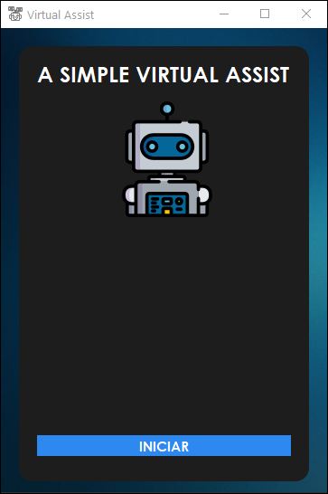
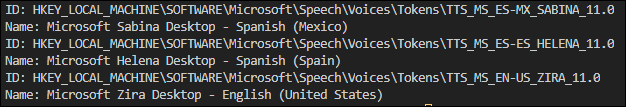
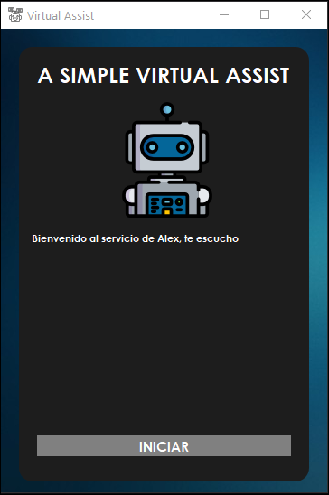
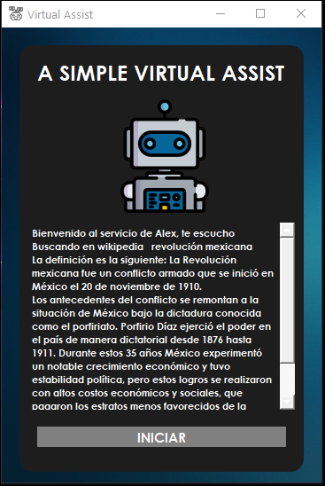
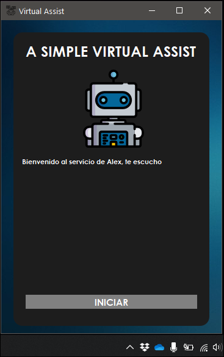

# Virtual Assist
## A easy and simple virtual assistant with Python

# All commands for Alex
Alex only detect commands in Spanish, for example:

> `Alex reproduce Zomboy` 

> `Alex busca en google lenguajes de programación`

> `Alex busca en wikipedia revolución mexicana`

> `Alex que día es hoy`

> `Alex que hora es`

> `Alex hola`

> `Alex como estas`

> `Alex dentente/para/finaliza/deten/stop`

# Voices for virtual assist
Run `python allvoices.py` and you will see the voices installed in the OS.

# How to run?
Double click in `main.pyw` 
or 
> `python main.pyw` 

in command prompt.

# What do you need?
We need _PyQt5, PyAudio, SpeechRecognition, pyttsx3, pywhatkit and wikipedia_

## How to install all Python packages? 
> pip install PyQt5 

> pip install PyAudio

> pip install SpeechRecognition

> pip install pyttsx3

> pip install pywhatkit

> pip install wikipedia

# UI and Messages
After run the file `main.pyw` will show this UI.

Press **INICIAR** and the simple Virtual Assist are listening you.

The virtual assist will say his name and listening you.

All the commands are printed to the UI and Alex says them.

For example in this case the command is: 

`Alex busca en wikipedia revolución mexicana`

# Cautions and Warnings
Please check the mic in Windows is active.

# Resources
https://pypi.org/project/PyQt5/

https://pypi.org/project/PyAudio/

https://pypi.org/project/SpeechRecognition/

https://pypi.org/project/pyttsx3/

https://pypi.org/project/pywhatkit/

https://pypi.org/project/wikipedia/